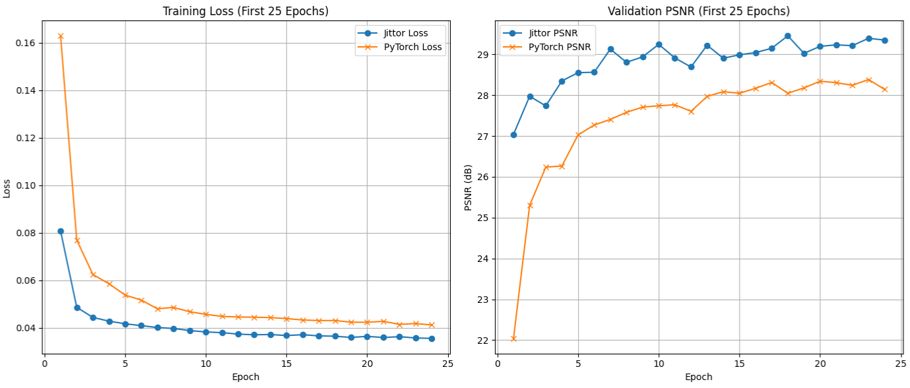

# LIIF-Jittor By lzl

This repository provides the Jittor reimplementation of LIIF, as introduced in the following paper:<br>
[**Learning Continuous Image Representation with Local Implicit Image Function**](https://arxiv.org/abs/2012.09161)
<br>
[Yinbo Chen](https://yinboc.github.io/), [Sifei Liu](https://www.sifeiliu.net/), [Xiaolong Wang](https://xiaolonw.github.io/)
<br>
CVPR 2021 

### Aligned Convergence between Jittor and PyTorch

<p align="center"></p>

<div align="center">Figure 1: Training loss curves of PyTorch and Jittor implementations (first 25 epochs).</div>
As shown in Fig. 1, due to computational constraints, I only ran the training for 25 epochs. It can be observed 
that the Jittor implementation converges faster than the official PyTorch version within this range. However, it is 
likely that the PyTorch version would achieve much better performance if allowed to train for more epochs.

### Runtime Logs

#### Jittor:
```angular2html
/root/miniconda3/envs/sfl/bin/python3.11 /python_porject/multi_project/liif-jittor/train_liif.py 
[i 0807 22:22:33.697484 00 compiler.py:956] Jittor(1.3.10.0) src: /root/miniconda3/envs/sfl/lib/python3.11/site-packages/jittor
[i 0807 22:22:33.699142 00 compiler.py:957] g++ at /usr/bin/g++(11.4.0)
[i 0807 22:22:33.699270 00 compiler.py:958] cache_path: /root/.cache/jittor/jt1.3.10/g++11.4.0/py3.11.11/Linux-5.4.0-18xf5/IntelRXeonRPlax40/e859/default
[i 0807 22:22:33.701473 00 __init__.py:412] Found /usr/local/cuda/bin/nvcc(12.1.105) at /usr/local/cuda/bin/nvcc.
[i 0807 22:22:33.703249 00 __init__.py:412] Found addr2line(2.38) at /usr/bin/addr2line.
[i 0807 22:22:34.115142 00 compiler.py:1013] cuda key:cu12.1.105_sm_86
[i 0807 22:22:34.553876 00 __init__.py:227] Total mem: 375.80GB, using 16 procs for compiling.
[i 0807 22:22:34.665208 00 jit_compiler.cc:28] Load cc_path: /usr/bin/g++
[i 0807 22:22:34.812215 00 init.cc:63] Found cuda archs: [86,]
config loaded.
./save/test_0 exists, remove? (y/[n]): y
y
train dataset: size=16000
  inp: shape=(3, 48, 48)
  coord: shape=(2304, 2)
  cell: shape=(2304, 2)
  gt: shape=(2304, 3)
val dataset: size=1600
  inp: shape=(3, 48, 48)
  coord: shape=(2304, 2)
  cell: shape=(2304, 2)
  gt: shape=(2304, 3)
[i 0807 22:25:32.373838 00 cuda_flags.cc:55] CUDA enabled.
model: #params=1.6M
epoch 1/1000, train: loss=0.0807, val: psnr=27.0411, 1.3m 1.3m/21.9h
epoch 2/1000, train: loss=0.0486, val: psnr=27.9734, 1.2m 2.5m/21.2h
epoch 3/1000, train: loss=0.0443, val: psnr=27.7377, 1.2m 3.8m/20.9h
epoch 4/1000, train: loss=0.0428, val: psnr=28.3503, 1.2m 5.0m/20.8h
epoch 5/1000, train: loss=0.0417, val: psnr=28.5515, 1.2m 6.2m/20.7h
epoch 6/1000, train: loss=0.0409, val: psnr=28.5624, 1.2m 7.4m/20.7h
epoch 7/1000, train: loss=0.0401, val: psnr=29.1278, 1.2m 8.7m/20.6h
epoch 8/1000, train: loss=0.0397, val: psnr=28.8056, 1.2m 9.9m/20.6h
epoch 9/1000, train: loss=0.0388, val: psnr=28.9391, 1.2m 11.1m/20.6h
epoch 10/1000, train: loss=0.0382, val: psnr=29.2455, 1.2m 12.3m/20.5h
epoch 11/1000, train: loss=0.0379, val: psnr=28.9120, 1.2m 13.5m/20.5h
epoch 12/1000, train: loss=0.0373, val: psnr=28.6913, 1.2m 14.8m/20.5h
epoch 13/1000, train: loss=0.0370, val: psnr=29.2242, 1.2m 16.0m/20.5h
epoch 14/1000, train: loss=0.0371, val: psnr=28.9058, 1.2m 17.2m/20.5h
epoch 15/1000, train: loss=0.0367, val: psnr=28.9892, 1.2m 18.4m/20.5h
epoch 16/1000, train: loss=0.0371, val: psnr=29.0440, 1.2m 19.6m/20.5h
epoch 17/1000, train: loss=0.0366, val: psnr=29.1492, 1.2m 20.9m/20.5h
epoch 18/1000, train: loss=0.0364, val: psnr=29.4549, 1.2m 22.1m/20.5h
epoch 19/1000, train: loss=0.0359, val: psnr=29.0255, 1.2m 23.3m/20.5h
epoch 20/1000, train: loss=0.0364, val: psnr=29.1965, 1.2m 24.5m/20.5h
epoch 21/1000, train: loss=0.0359, val: psnr=29.2335, 1.2m 25.8m/20.4h
epoch 22/1000, train: loss=0.0362, val: psnr=29.2130, 1.2m 27.0m/20.4h
epoch 23/1000, train: loss=0.0357, val: psnr=29.3942, 1.2m 28.2m/20.4h
epoch 24/1000, train: loss=0.0355, val: psnr=29.3504, 1.2m 29.4m/20.4h
epoch 25/1000, train: loss=0.0356, val: psnr=29.2892, 1.2m 30.6m/20.4h
```
#### Pytorch:
```angular2html
/root/miniconda3/envs/sfl/bin/python3.11 /python_porject/multi_project/liif/train_liif.py 
config loaded.
./save/test_0 exists, remove? (y/[n]): y
y
train dataset: size=16000
/root/miniconda3/envs/sfl/lib/python3.11/site-packages/torch/functional.py:512: UserWarning: torch.meshgrid: in an upcoming release, it will be required to pass the indexing argument. (Triggered internally at /opt/conda/conda-bld/pytorch_1712608853085/work/aten/src/ATen/native/TensorShape.cpp:3587.)
  return _VF.meshgrid(tensors, **kwargs)  # type: ignore[attr-defined]
  inp: shape=(3, 48, 48)
  coord: shape=(2304, 2)
  cell: shape=(2304, 2)
  gt: shape=(2304, 3)
val dataset: size=1600
  inp: shape=(3, 48, 48)
  coord: shape=(2304, 2)
  cell: shape=(2304, 2)
  gt: shape=(2304, 3)
model: #params=1.6M
epoch 1/1000, train: loss=0.1630, val: psnr=22.0421, 1.2m 1.2m/20.6h
epoch 2/1000, train: loss=0.0770, val: psnr=25.3022, 1.2m 2.5m/20.6h
epoch 3/1000, train: loss=0.0624, val: psnr=26.2375, 1.2m 3.7m/20.5h
epoch 4/1000, train: loss=0.0585, val: psnr=26.2660, 1.2m 4.9m/20.5h
epoch 5/1000, train: loss=0.0537, val: psnr=27.0262, 1.3m 6.2m/20.6h
epoch 6/1000, train: loss=0.0517, val: psnr=27.2692, 1.2m 7.4m/20.6h
epoch 7/1000, train: loss=0.0480, val: psnr=27.4069, 1.2m 8.7m/20.6h
epoch 8/1000, train: loss=0.0486, val: psnr=27.5804, 1.2m 9.9m/20.6h
epoch 9/1000, train: loss=0.0467, val: psnr=27.7079, 1.2m 11.1m/20.6h
epoch 10/1000, train: loss=0.0456, val: psnr=27.7409, 1.2m 12.3m/20.6h
epoch 11/1000, train: loss=0.0448, val: psnr=27.7654, 1.2m 13.6m/20.6h
epoch 12/1000, train: loss=0.0445, val: psnr=27.6055, 1.2m 14.8m/20.5h
epoch 13/1000, train: loss=0.0444, val: psnr=27.9689, 1.2m 16.0m/20.5h
epoch 14/1000, train: loss=0.0443, val: psnr=28.0864, 1.2m 17.2m/20.5h
epoch 15/1000, train: loss=0.0439, val: psnr=28.0472, 1.2m 18.5m/20.5h
epoch 16/1000, train: loss=0.0433, val: psnr=28.1690, 1.2m 19.7m/20.5h
epoch 17/1000, train: loss=0.0430, val: psnr=28.3121, 1.2m 20.9m/20.5h
epoch 18/1000, train: loss=0.0430, val: psnr=28.0477, 1.2m 22.1m/20.5h
epoch 19/1000, train: loss=0.0423, val: psnr=28.1777, 1.2m 23.4m/20.5h
epoch 20/1000, train: loss=0.0423, val: psnr=28.3416, 1.2m 24.6m/20.5h
epoch 21/1000, train: loss=0.0427, val: psnr=28.3076, 1.2m 25.8m/20.5h
epoch 22/1000, train: loss=0.0414, val: psnr=28.2423, 1.2m 27.0m/20.5h
epoch 23/1000, train: loss=0.0418, val: psnr=28.3835, 1.2m 28.3m/20.5h
epoch 24/1000, train: loss=0.0412, val: psnr=28.1418, 1.2m 29.5m/20.5h
epoch 25/1000, train: loss=0.0417, val: psnr=28.5978, 1.2m 30.7m/20.5h
epoch 26/1000, train: loss=0.0417, val: psnr=28.5592, 1.2m 31.9m/20.5h
```

### Environment
- Python 3.11
- Jittor 1.3.10.0
- TensorboardX
- yaml, numpy, tqdm, imageio

## Reproducing Experiments

### Data

`mkdir load` for putting the dataset folders.

- **DIV2K**: `mkdir` and `cd` into `load/div2k`. Download HR images and bicubic validation LR images from [DIV2K website](https://data.vision.ee.ethz.ch/cvl/DIV2K/) (i.e. [Train_HR](http://data.vision.ee.ethz.ch/cvl/DIV2K/DIV2K_train_HR.zip), [Valid_HR](http://data.vision.ee.ethz.ch/cvl/DIV2K/DIV2K_valid_HR.zip), [Valid_LR_X2](http://data.vision.ee.ethz.ch/cvl/DIV2K/DIV2K_valid_LR_bicubic_X2.zip), [Valid_LR_X3](http://data.vision.ee.ethz.ch/cvl/DIV2K/DIV2K_valid_LR_bicubic_X3.zip), [Valid_LR_X4](http://data.vision.ee.ethz.ch/cvl/DIV2K/DIV2K_valid_LR_bicubic_X4.zip)). `unzip` these files to get the image folders.

- **benchmark datasets**: `cd` into `load/`. Download and `tar -xf` the [benchmark datasets](https://cv.snu.ac.kr/research/EDSR/benchmark.tar) (provided by [this repo](https://github.com/thstkdgus35/EDSR-PyTorch)), get a `load/benchmark` folder with sub-folders `Set5/, Set14/, B100/, Urban100/`.

- **celebAHQ**: `mkdir load/celebAHQ` and `cp scripts/resize.py load/celebAHQ/`, then `cd load/celebAHQ/`. Download and `unzip` data1024x1024.zip from the [Google Drive link](https://drive.google.com/drive/folders/11Vz0fqHS2rXDb5pprgTjpD7S2BAJhi1P?usp=sharing) (provided by [this repo](github.com/suvojit-0x55aa/celebA-HQ-dataset-download)). Run `python resize.py` and get image folders `256/, 128/, 64/, 32/`. Download the [split.json](https://www.dropbox.com/s/2qeijojdjzvp3b9/split.json?dl=0).

### Running the code

**0. Preliminaries**

- For `train_liif.py` or `test.py`, use `--gpu [GPU]` to specify the GPUs (e.g. `--gpu 0` or `--gpu 0,1`).

- For `train_liif.py`, by default, the save folder is at `save/_[CONFIG_NAME]`. We can use `--name` to specify a name if needed.

- For dataset args in configs, `cache: in_memory` denotes pre-loading into memory (may require large memory, e.g. ~40GB for DIV2K), `cache: bin` denotes creating binary files (in a sibling folder) for the first time, `cache: none` denotes direct loading.

**1. DIV2K experiments**

**Train**: `python train_liif.py --config configs/train-div2k/train_edsr-baseline-liif.yaml` (We can use mang backbone as shown in Config Folder). I use 1 GPU 3090RTX for training EDSR-baseline-LIIF.

**Test**: `python test.py --config configs/test/test-div2k-6.yaml --model save/test_0/epoch-best.pth` Adjust the downsampling scale by modifying the configuration YAML file.Note that you need to manually adjust the model definition in test.py according to the architecture of the model you trained, as shown below (I offer the epoch-best.pth in ./save/test_0).
```python
model = models.make({   #注意要根据自己的模型调整
    'name': 'liif',
    'args': {
        'encoder_spec': {
            'name': 'edsr-baseline',
            'args': {
                'no_upsampling': True
            }
        },
        'imnet_spec': {
            'name': 'mlp',
            'args': {
                'out_dim': 3,
                'hidden_list': [256, 256, 256, 256]
            }
        }
    }
})
```

**2. celebAHQ experiments**

**Train**: `python train_liif.py --config configs/train-celebAHQ/[CONFIG_NAME].yaml`.

**Test**: `python test.py --config configs/test/test-celebAHQ-32-256.yaml --model [MODEL_PATH]` (or `test-celebAHQ-64-128.yaml` for another task).

**3. test log**
```angular2html
[i 0808 01:12:58.861877 40 compiler.py:956] Jittor(1.3.10.0) src: /root/miniconda3/envs/sfl/lib/python3.11/site-packages/jittor
[i 0808 01:12:58.863474 40 compiler.py:957] g++ at /usr/bin/g++(11.4.0)
[i 0808 01:12:58.863602 40 compiler.py:958] cache_path: /root/.cache/jittor/jt1.3.10/g++11.4.0/py3.11.11/Linux-5.4.0-18xf5/IntelRXeonRPlax40/e859/default
[i 0808 01:12:58.865817 40 __init__.py:412] Found /usr/local/cuda/bin/nvcc(12.1.105) at /usr/local/cuda/bin/nvcc.
[i 0808 01:12:58.867673 40 __init__.py:412] Found addr2line(2.38) at /usr/bin/addr2line.
[i 0808 01:12:59.293832 40 compiler.py:1013] cuda key:cu12.1.105_sm_86
[i 0808 01:12:59.714040 40 __init__.py:227] Total mem: 375.80GB, using 16 procs for compiling.
[i 0808 01:12:59.826149 40 jit_compiler.cc:28] Load cc_path: /usr/bin/g++
[i 0808 01:12:59.942166 40 init.cc:63] Found cuda archs: [86,]
[i 0808 01:13:01.362817 40 cuda_flags.cc:55] CUDA enabled.
[w 0808 01:13:01.427272 40 __init__.py:1645] load parameter feat failed ...
[w 0808 01:13:01.437357 40 __init__.py:1664] load total 87 params, 1 failed
result: 26.0567
```
